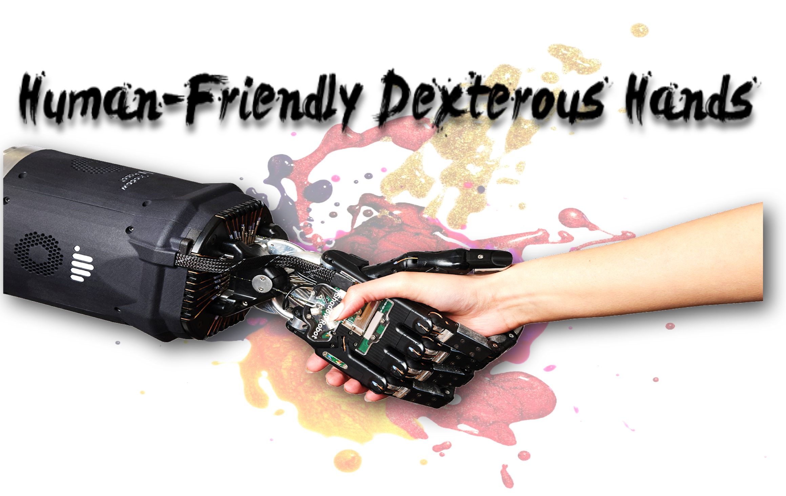
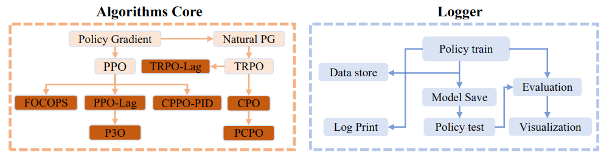
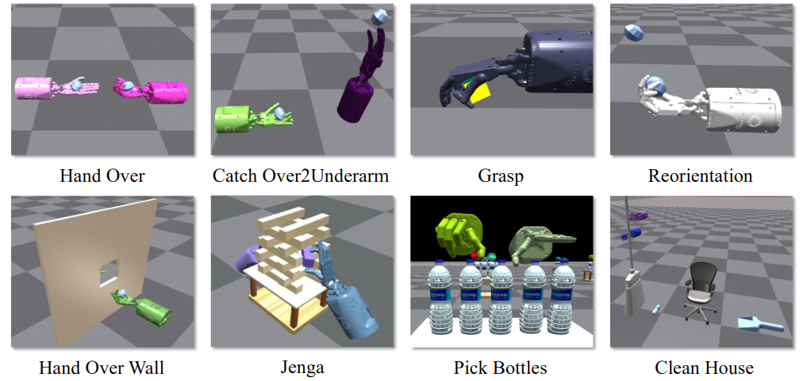
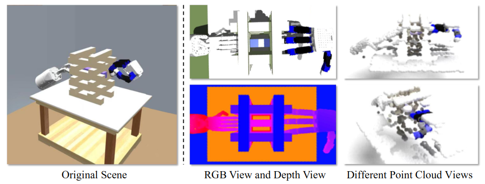
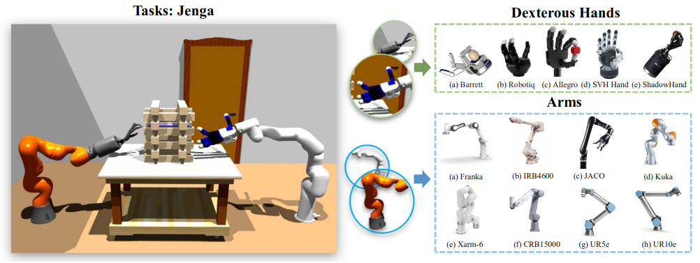

[](https://github.com/PKU-MARL "Organization") [](https://github.com/PKU-MARL "Unittest") [](https://github.com/PKU-MARL "Docs") [](https://github.com/PKU-MARL/DexterousHands/blob/main/LICENSE)

**ReDMan** is an open-source simulation platform that provides a standardized implementation of safe RL algorithms for **Re**liable **D**exterous **Man**ipulation.

- **For Safe RL researchers**
     We present a novel framework for Safe RL algorithms that is unified, highly optimized, and extensible, with re-implementations of commonly used algorithms that support ReDMan and popular environments. Our framework emphasizes abstraction and encapsulation to encourage code reuse and maintain a clean code style. We also provide a suite of intricate and demanding safe dexterous manipulation tasks that are motivated by the requirement for safe robotic manipulation in daily life scenarios, such as cleaning floors without damaging furniture. Exhaustive experiments with our implemented algorithms were conducted in these environments, and we share the results, observations, and analyses to benefit the Safe RL community.

- **For Robotic researchers**
     We present the inaugural compilation of tasks aimed at safe dexterous manipulations. Along with safety considerations, we offer various features, such as multi-modal observation information that includes contact force, RGB image, RGB-D image, point cloud, and more. Additionally, our platform boasts customizable dexterous hands and a robotic arm drive specifically tailored to the dexterous hand. These features collectively provide an all-encompassing platform for robotic research.

Contents of this repo are as follows:
- [Introduction](#introduction)
- [Getting Started](#getting-started)
  - [Installation](#installation)
  - [Algorithms](#algorithms)
  - [Tasks](#tasks)
  - [Constraint Task List](#constraint-task-list)
  - [Run Command](#run-command)
  - [Visual Input](#visual-input)
  - [Available Hands and Arms](#available-hands-and-arms)
- [The Team](#the-team)
- [License](#license)
****

## Introduction

This repository contains complex safe dexterous hands control tasks. ReDMan is built in the NVIDIA Isaac Gym with high performance guarantee for training RL algorithms. Our environments focus on applying safe RL algorithms for dexterous manipulation.

## Getting Started

### Installation

Details regarding installation of IsaacGym can be found [here](https://developer.nvidia.com/isaac-gym). **We currently support the `Preview Release 4` version of IsaacGym.**

The code has been tested on Ubuntu 18.04 with Python 3.8. The minimum recommended NVIDIA driver
version for Linux is `470.74` (dictated by support of IsaacGym).

It uses [Anaconda](https://www.anaconda.com/) to create virtual environments.
To install Anaconda, follow instructions [here](https://docs.anaconda.com/anaconda/install/linux/).

Ensure that Isaac Gym works on your system by running one of the examples from the `python/examples`
directory, like `joint_monkey.py`. Please follow troubleshooting steps described in the Isaac Gym Preview 3
install instructions if you have any trouble running the samples.

Once Isaac Gym is installed and samples work within your current python environment, install this repo and install the dependence:

```bash
git clone https://github.com/OmniSafeAI/ReDMan.git
cd ReDMan
pip install -e .
```

### Algorithms



|Algorithm| Proceedings&Cites| Official Code Repo | Official Code Last Update | Official Github Stars | Command Line |
|:-------------:|:------------:|:-------------:|:---------------:|:---------------:|:---------------:|
|[PPO-Lag](https://cdn.openai.com/safexp-short.pdf)| :x: | [Tensorflow1 ](https://github.com/openai/safety-starter-agents)|  | [](https://github.com/openai/safety-starter-agents/stargazers) |ppol|
|[TRPO-Lag](https://cdn.openai.com/safexp-short.pdf)| :x: | [Tensorflow1](https://github.com/openai/safety-starter-agents) |  | [](https://github.com/openai/safety-starter-agents/stargazers) |trpol|
|[FOCOPS](https://arxiv.org/pdf/2002.06506.pdf) | Neurips 2020 (Cite: 27) | [Pytorch](https://github.com/ymzhang01/focops) |  | [](https://github.com/ymzhang01/focops/stargazers) |focops|
|[CPO](https://arxiv.org/abs/1705.10528) | ICML 2017(Cite: 663) | :x: | :x: | :x: |cpo|
|[PCPO](https://arxiv.org/pdf/2010.03152.pdf) | ICLR 2020(Cite: 67) | [Theano](https://sites.google.com/view/iclr2020-pcpo) | :x: | :x: |pcpo|
|[P3O](https://arxiv.org/pdf/2205.11814.pdf) | IJCAI 2022(Cite: 0) | :x: | :x: | :x: |p3o|
|[CPPO-PID](https://arxiv.org/pdf/2007.03964.pdf) | Neurips 2020(Cite: 71) | [Pytorch](https://github.com/astooke/rlpyt/tree/master/rlpyt/projects/safe) |  | [](https://github.com/astooke/rlpyt/stargazers) |cppo_pid|

### Tasks

So far, we release the following tasks (with many more to come):



### Constraint Task List

- ShadowHandCatchOver2Underarm_Safe_finger
- ShadowHandCatchOver2Underarm_Safe_joint
- ShadowHandOver_Safe_finger
- ShadowHandOver_Safe_joint
- ShadowHandGrasp
- ShadowHandDieRotation
- ShadowHandCatchUnderarmWall
- ShadowHandCatchUnderarmWallDown
- ShadowHandOverWall
- ShadowHandOverWallDown
- ShadowHandPickBottle
- ShadowHandDrawBlocks
- ShadowHandClean

### Run Command

```python
python train.py --task=ShadowHandOver --algo=ppol --cost_lim 25.0
```

For more information about running commands, please refer to [experiment.md](experiment.md) in the root directory

### Visual Input

 We provide multiple modalities of visual information as input, including **RGB, RGB-D, and point cloud**. It is generated using the camera in the Isaac Gym, and the pose and toward of the camera can be customized by the user to obtain the desired visual observation.



### Available Hands and Arms
To promote research and community development in the field, having multiple types of dexterous hands, such as the Shadow Hand, Allegro Hand, and Tri-Finger, is crucial. ReDMan goes beyond offering just the Shadow Hand, by providing a selection of **five other dexterous multi-finger hands**.

Incorporating a robotic arm drive at the base of the dexterous hand not only mimics real-world conditions but also represents an essential step in achieving successful sim-to-real transfer. Due to the inherent difficulty in reproducing the true dynamics of a flying hand, the ReDMan platform simplifies the deployment process from simulation to real-world applications by permitting adjustments to **the dynamics and physics parameters of the arm** to minimize the reality gap.



## The Team

ReDMan is a project contributed by **Yiran Geng, Jiaming Ji, Yuanpei Chen, Haoran Geng, Fangwei Zhong and Yaodong Yang** at Peking University, please contact yaodong.yang@pku.edu.cn if you are interested to collaborate.

We also thank **Chenrui Tie** for contributing to a variety of robotic arm and dexterous hand tasks.

## License

ReDMan has an Apache license, as found in the [LICENSE](https://github.com/OmniSafeAI/ReDMan/blob/main/LICENSE) file.
